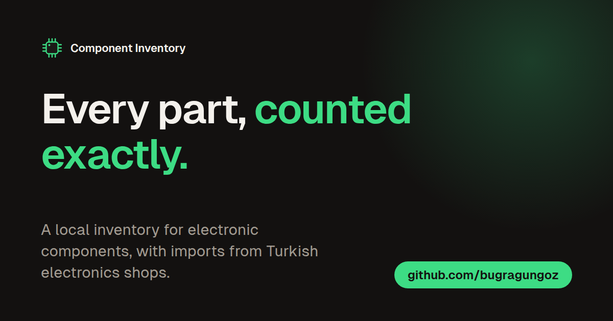

<p align="center"></p>

# Component Inventory

A local-first Windows app for an inventory of electronic components. It keeps what you have, where
it is and what your projects need, and imports orders from Turkish electronics shops through a
browser extension or from a spreadsheet.

[Türkçe](README.md) · [Changelog](CHANGELOG.md) · [Contributing](CONTRIBUTING.md) · [Download](https://github.com/bugragungoz/component-inventory/releases/latest)


## What it does

- **Exact counts.** One table without pages, smooth at 100,000 rows; search that folds Turkish letters
  (`direnc` finds `DİRENÇ`); an icon for every category and subcategory; low-stock marks and a stock
  history for every change.
- **Check before anything is written.** Shop orders come in through the extension, Excel and CSV files
  through the Import screen. Each line shows why its count is what it is ("10 units x 10-piece pack =
  100 pieces"). Add to stock, set counts or replace, and undo an import later.
- **Storage places.** Put parts in places named like the boxes and drawers on your desk; renaming a
  place moves every part in it.
- **Projects.** A parts list per project with what is missing, and the schematic beside it (PDF, image
  or KiCad).
- **Labels and export.** QR label sheets; Excel, CSV, JSON and a PDF list.
- **Your data stays with you.** Everything is in a SQLite database on your computer, with a backup before
  every bulk change. An optional Google Drive copy lets you look at your stock from your phone.

## Install

1. From [Releases](https://github.com/bugragungoz/component-inventory/releases/latest) download **one**:
   - `Component.Inventory_<version>_x64-setup.exe`: installs for your Windows user only, no admin
     rights (recommended).
   - `Component.Inventory_<version>_x64_en-US.msi`: installs for the whole computer, asks for admin.
2. Run it. The installers are not signed yet; if SmartScreen asks, choose **More info** > **Run anyway**.
3. Over an older version, install the same kind on top. On the first start a copy of your database goes
   to `backups`, then it is moved to the new format.

Data folder: `%APPDATA%\com.bugragungoz.component-inventory` (also shown in Settings).

### Browser extension (Brave, Chrome, Edge)

1. From the same release download `component-inventory-extension-<version>.zip` and unzip it into a
   folder you keep (for example `Documents\component-inventory-extension`).
2. Open `brave://extensions` (or `chrome://extensions`, `edge://extensions`) and turn on **Developer
   mode** at the top right.
3. Choose **Load unpacked** and pick the folder.
4. Open an order page of a supported shop. The panel at the bottom right says how many lines it found:
   **Send to the app** opens the review in the app. If the browser asks whether to open the app, allow it.

If the app does not open, use **Save as file** in the panel and drop the `.cinv.json` file on the
app's Import screen. For a new version, unzip into the same folder and press reload on the extension.

## Coming later

- **PDF import:** reading printed order pages does not work yet and will be fixed.
- Text recognition for scanned (image) PDFs.
- Filling category and package from a shop's product page.
- Signed installers.

## Translations

Turkish and English are complete. German, Russian, Simplified Chinese and Arabic are translated but
not yet read by a native speaker; the app marks them "not reviewed".

To correct a language or add one, edit `src/locales/<locale>.json`, check it with `npm run
check:locales` and open a pull request. Details: [CONTRIBUTING.md](CONTRIBUTING.md#translations).

## Development

Node.js 22.5+, Rust stable, and WebView2 on Windows.

```bash
npm ci                 # dependencies
npm run dev            # the app, live
npm run build          # installers: target/release/bundle
npm run ext:build      # extension: extension/dist
npm run verify         # versions, locales, lint, types, unit tests
cargo test --workspace # the Rust core
```

| Part | What |
|---|---|
| `crates/inventory-core` | All data: SQLite schema and migrations, imports with undo, backups, export. |
| `src-tauri` | Tauri shell: windows, the `component-inventory://` link, timers. |
| `src` | Interface: TypeScript, Preact, the [Bugra design system](docs/design/bugra/README.md). |
| `packages/cinv` | The format shared by the extension and the app, and each shop's pack rule. |
| `extension` | Manifest V3 browser extension. |

## Privacy

No account, no telemetry. The app goes online only to check for a new version (can be turned off) and,
if you turn it on, to write copies into your Google Drive folder. The extension reads only product
names and counts from the page and sends them only to the app on this computer.

## License

[MIT](LICENSE)

---

Coded with Opus 5.5.
