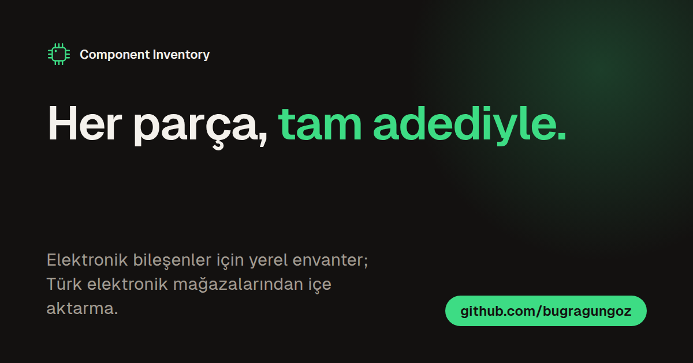
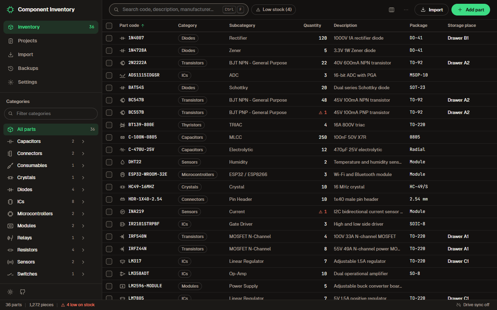
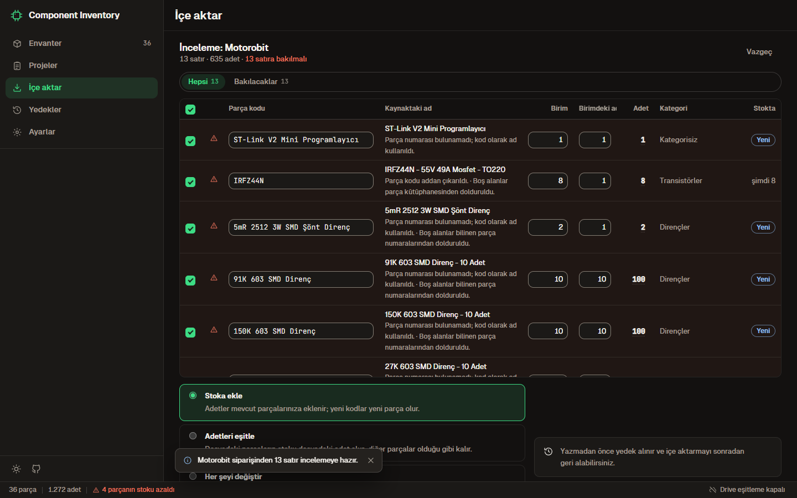
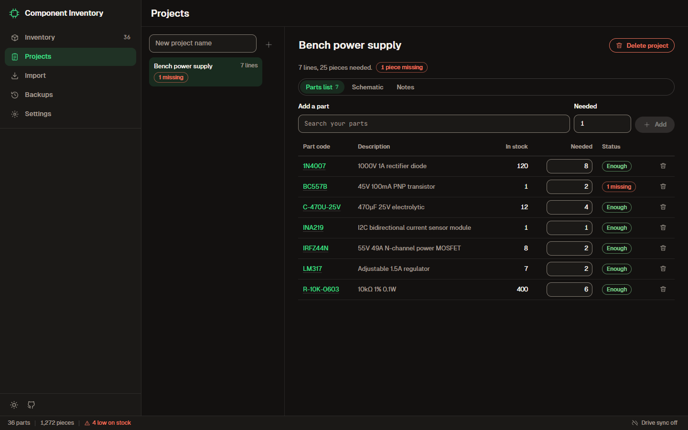

<p align="center"></p>

# Component Inventory

Elektronik bileşenler için Windows'ta çalışan, verisi bilgisayarınızda kalan bir stok uygulaması.
Elinizdeki parçaları, nerede durduklarını ve projelerinizin neye ihtiyaç duyduğunu tutar; Türk
elektronik mağazalarından verdiğiniz siparişleri tarayıcı eklentisiyle ya da bir tablodan alır.

[English](README.en.md) · [Değişiklikler](CHANGELOG.md) · [Katkı](CONTRIBUTING.md) · [İndir](https://github.com/bugragungoz/component-inventory/releases/latest)



## Neler yapar

- **Tam adet.** Sayfasız, 100.000 satırda bile akıcı bir tablo; Türkçe harfleri doğru eşleyen arama
  (`direnc` yazınca `DİRENÇ` bulunur); her kategori ve alt kategori için simge; azalan stok işareti ve
  her değişikliğin stok geçmişi.
- **Önce kontrol, sonra kayıt.** Mağaza siparişleri eklentiyle, Excel ve CSV dosyaları içe aktarma
  ekranıyla gelir. Her satırda adedin neden öyle olduğu görünür ("10 birim x 10'lu paket = 100 adet").
  Stoka ekleyin, adetleri eşitleyin ya da tamamını değiştirin; içe aktarmayı sonradan geri alın.
- **Saklama yerleri.** Parçaları masanızdaki kutu ve çekmecelerle aynı adlı yerlere koyun; bir yerin
  adını değiştirince içindeki bütün parçalar taşınır.
- **Projeler.** Her proje için eksikleri gösteren parça listesi ve yanında şema (PDF, görsel ya da
  KiCad).
- **Etiket ve dışa aktarma.** QR kodlu etiket kâğıtları; Excel, CSV, JSON ve PDF liste.
- **Veri sizde.** Her şey bilgisayarınızdaki bir SQLite veritabanında durur. Her toplu işlemden önce
  yedek alınır. İsteğe bağlı Google Drive kopyasıyla stoka telefondan bakılır.

| İçe aktarma incelemesi | Proje parça listesi |
|---|---|
|  |  |

## Kurulum

1. [Releases](https://github.com/bugragungoz/component-inventory/releases/latest) sayfasından **birini**
   indirin:
   - `Component.Inventory_<sürüm>_x64-setup.exe`: yalnızca sizin kullanıcınıza kurulur, yönetici izni
     istemez (önerilen).
   - `Component.Inventory_<sürüm>_x64_tr-TR.msi`: bilgisayarın tamamına kurulur, yönetici onayı ister.
2. Çalıştırın. Kurulum dosyaları henüz imzalı değil; Windows SmartScreen sorarsa **Ek bilgi** >
   **Yine de çalıştır**.
3. Eski bir sürüm kuruluysa aynı türden kurulumla üzerine kurun. İlk açılışta veritabanınızın bir
   kopyası `backups` klasörüne alınır, sonra yeni biçime taşınır.

Verilerin yeri: `%APPDATA%\com.bugragungoz.component-inventory` (Ayarlar'da da yazar).

### Tarayıcı eklentisi (Brave, Chrome, Edge)

1. Aynı sürüm sayfasından `component-inventory-extension-<sürüm>.zip` dosyasını indirip kalıcı bir
   klasöre açın (örneğin `Belgeler\component-inventory-extension`).
2. Adres çubuğuna `brave://extensions` (ya da `chrome://extensions`, `edge://extensions`) yazın,
   sağ üstten **Geliştirici modu**nu açın.
3. **Paketlenmemiş öğe yükle**'ye basıp açtığınız klasörü seçin.
4. Desteklenen bir mağazanın sipariş sayfasını açın. Sağ alttaki panel kaç satır bulduğunu yazar:
   **Uygulamaya aktar** uygulamada inceleme ekranını açar. Tarayıcı "uygulama açılsın mı?" diye
   sorarsa izin verin.

Uygulama açılmazsa panelde **Dosya olarak kaydet**'e basın ve inen `.cinv.json` dosyasını uygulamanın
İçe aktar ekranına bırakın. Yeni sürümde zip'i aynı klasöre açıp eklenti kartındaki yenile düğmesine
basmanız yeter.

## Sonra eklenecekler

- **PDF içe aktarma:** yazdırılmış sipariş sayfalarından okuma şu an çalışmıyor, düzeltilecek.
- Taranmış (görüntü) PDF'ler için metin tanıma.
- Mağaza ürün sayfasından kategori ve kılıf bilgisini otomatik doldurma.
- İmzalı kurulum dosyaları.

## Çeviriler

Türkçe ve İngilizce tam. Almanca, Rusça, Basitleştirilmiş Çince ve Arapça çevrilmiş ama anadili olan
biri tarafından okunmadı; uygulamada "gözden geçirilmedi" diye görünürler.

Düzeltmek ya da yeni dil eklemek için `src/locales/<dil>.json` dosyasını düzenleyin, `npm run
check:locales` ile denetleyin ve bir pull request açın. Ayrıntılar:
[CONTRIBUTING.md](CONTRIBUTING.md#translations).

## Geliştirme

Node.js 22.5+, Rust stable ve Windows'ta WebView2 gerekir.

```bash
npm ci                 # bağımlılıklar
npm run dev            # uygulama, canlı
npm run build          # kurulum dosyaları: target/release/bundle
npm run ext:build      # eklenti: extension/dist
npm run verify         # sürümler, diller, lint, tipler, birim testleri
cargo test --workspace # Rust çekirdeği
```

| Bölüm | Ne |
|---|---|
| `crates/inventory-core` | Tüm veri: SQLite şeması ve geçişleri, içe aktarma ve geri alma, yedekler, dışa aktarma. |
| `src-tauri` | Tauri kabuğu: pencereler, `component-inventory://` bağlantısı, zamanlayıcılar. |
| `src` | Arayüz: TypeScript, Preact, [Bugra tasarım sistemi](docs/design/bugra/README.md). |
| `packages/cinv` | Eklenti ile uygulamanın ortak biçimi ve mağaza paket kuralları. |
| `extension` | Manifest V3 tarayıcı eklentisi. |

## Gizlilik

Hesap yok, telemetri yok. Uygulama internete yalnızca yeni sürüm kontrolü için (kapatılabilir) ve
açarsanız Google Drive klasörünüze kopya yazmak için çıkar. Eklenti sayfadan yalnızca ürün adlarını ve
adetleri okur, veriyi yalnızca bu bilgisayardaki uygulamaya gönderir.

## Lisans

[MIT](LICENSE)

---

Opus 5.5 ile kodlanmıştır.
